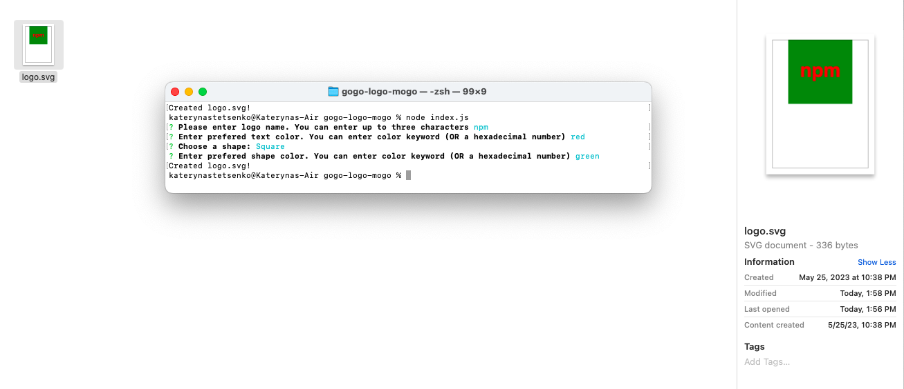

# gogo-logo-mogo

## Description

Github link
https://github.com/itcreativeusa/gogo-logo-mogo

Youtube video guide
https://youtu.be/-Cf7D6irPfY

This gogo-logo-mogo is Node.js command-line application that takes user input to generate a logo and save it as an [SVG file]. The application prompts the user to select a color, shape, and text for the logo and save the generated SVG to a `.svg` file.
It was created as a boot camp every week student challenge.

## Table of Contents 

- [Installation](#installation)
- [Usage](#usage)
- [Requirements](#requirements)
- [Credits](#credits)
- [Tests](#tests)
- [License](#license)

## Installation

This application must be installed on the computer. Open your computer’s command prompt (Windows) or terminal (macOS/Linux) and run the application
 
## Requirements

No special requirements

## Usage

Run node index.js in the terminal.
Follow the prompt questions.
The file readme.md will be generated in a root folder
Generated logo saves to the folder`/examples`. The file logo.svg has a size 300x200 pixel.

Simply add text to the text field and press save. After reloading the page, the text will be available.
 
The file `logo.svg` is located in a root folder. 
 
The screenshot is located in `img` folder

## Credits
 
Some code in the file `component.js` was taken from Mini-Project provided by Berkeley Bootcamp for studying purposes.
 
## Tests
Tests for classes: Circle, Triangle, and Square included. Tests located in folder `tests`.
Run `npm test` to see PASS all the tests.

## License

Please refer to the LICENSE in the repo.
